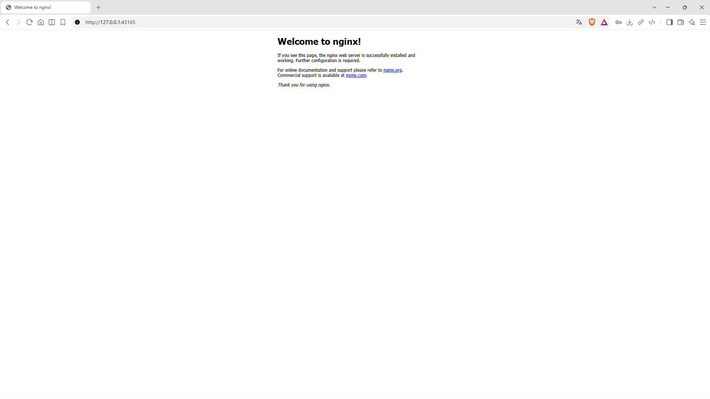

# Activity: Kubernetes Service Configuration

## 1. Browser Screenshot (Nginx Service)



## 2. Output of the `kubectl get svc` command

```bash
NAME            TYPE        CLUSTER-IP      EXTERNAL-IP   PORT(S)        AGE
kubernetes      ClusterIP   10.96.0.1       <none>        443/TCP        16m
nginx-service   NodePort    10.111.252.36   <none>        80:31481/TCP   5m20s
```
