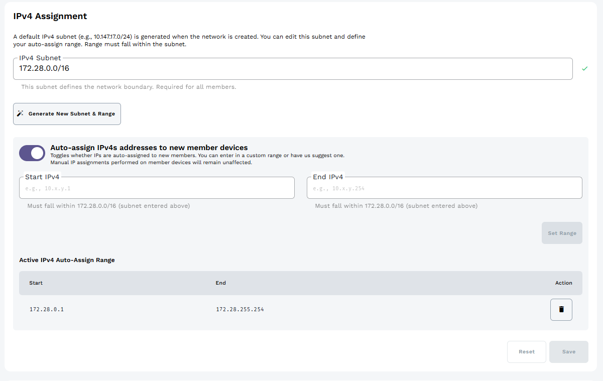
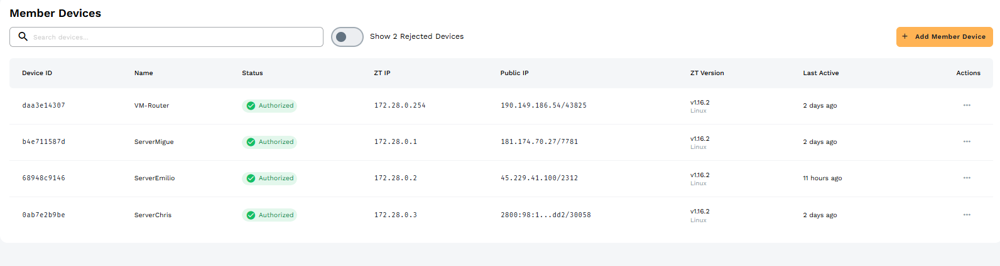
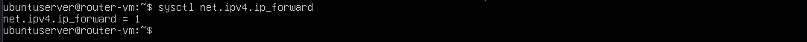
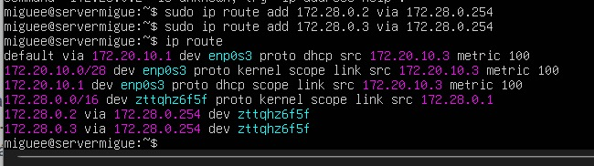
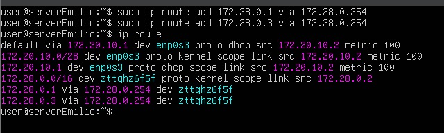
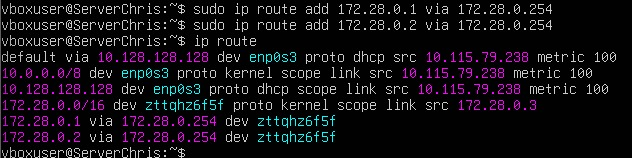
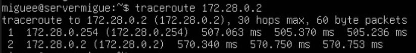
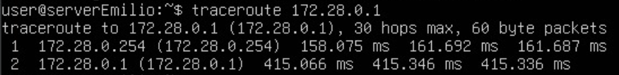
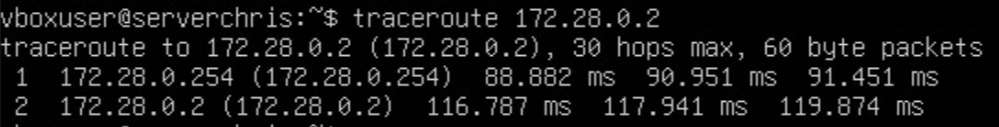

# Assessment01: Private Virtual Network (SDN) with ZeroTier

## Overview

This practice consists of creating a private virtual network using ZeroTier to interconnect four virtual machines running Ubuntu Server. One of the four machines was configured as a router using IP forwarding, enabling routed communication between the rest of the machines.

## Network topology

| Name         | Role   | ZeroTier IP  | Hostname     |
| ------------ | ------ | ------------ | ------------ |
| VM-Router    | Router | 172.28.0.254 | VM-Router    |
| ServerMigue  | Node   | 172.28.0.1   | ServerMigue  |
| ServerEmilio | Node   | 172.28.0.2   | ServerEmilio |
| ServerChris  | Node   | 172.28.0.3   | ServerChris  |

ZeroTier network: 172.28.0.0/16
Access Control: Private

All virtual machines were configured with a Bridged Adapter network mode, allowing each one to obtain direct connectivity within the host's local network and internet access for installing the ZeroTier client.

## Creating the virtual network on ZeroTier Central

A private network was created on ZeroTier Central, obtaining the corresponding Network ID. The network was configured with Access Control set to Private, and with the IPv4 range 172.28.0.0/16, with auto-assign enabled from 172.28.0.1 to 172.28.0.254



Static IP's assigned to each VM and authorized members on the Network


## Hostname configuration

The hostname of each virtual machine was configured using the hostnamectl command, matching the name assigned on ZeroTier Central:

```bash
sudo hostnamectl set-hostname VM-Router      # on VM-Router
sudo hostnamectl set-hostname ServerMigue    # on ServerMigue
sudo hostnamectl set-hostname ServerEmilio   # on ServerEmilio
sudo hostnamectl set-hostname ServerChris    # on ServerChris
```

## Router Configuration (IP Forwarding)

To allow `VM-Router` to act as the network's router, IPv4 forwarding was enabled at the kernel level. This was achieved by uncommenting the `net.ipv4.ip_forward=1` line in the `/etc/sysctl.conf` file. The configuration was applied and verified using the `sysctl -p` command.



## Routing Configuration on Client Nodes

By default, ZeroTier acts as a switch, allowing direct peer-to-peer communication. To force the traffic between the nodes to pass entirely through `VM-Router`, static routes were manually added to each client VM. The `/32` subnet mask was used to ensure these manual rules took absolute priority over the default ZeroTier routing table.







## Connectivity Testing and Demonstration

To verify the correct functioning of the SDN and the router configuration, `ping` and `traceroute` tests were executed between the nodes.

The `traceroute` results clearly show two hops: the first one reaching the router (`172.28.0.254`), and the second one reaching the final destination, confirming that the traffic is successfully being routed. Furthermore, the `ttl=63` value in the ping responses validates technically that the packets traversed the router instead of utilizing direct peer-to-peer connections.





### Video Evidence

A full demonstration of the working network, including the router configuration and successful routed `ping` and `traceroute` tests across the virtual machines, can be found in the following video:

[**Watch the Video Demonstration here!!!**](https://youtu.be/neJZcfbXqcs)
