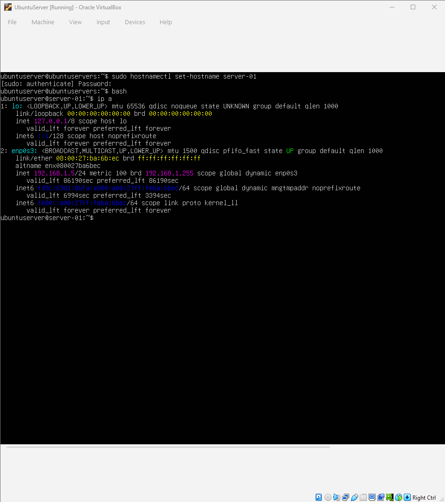
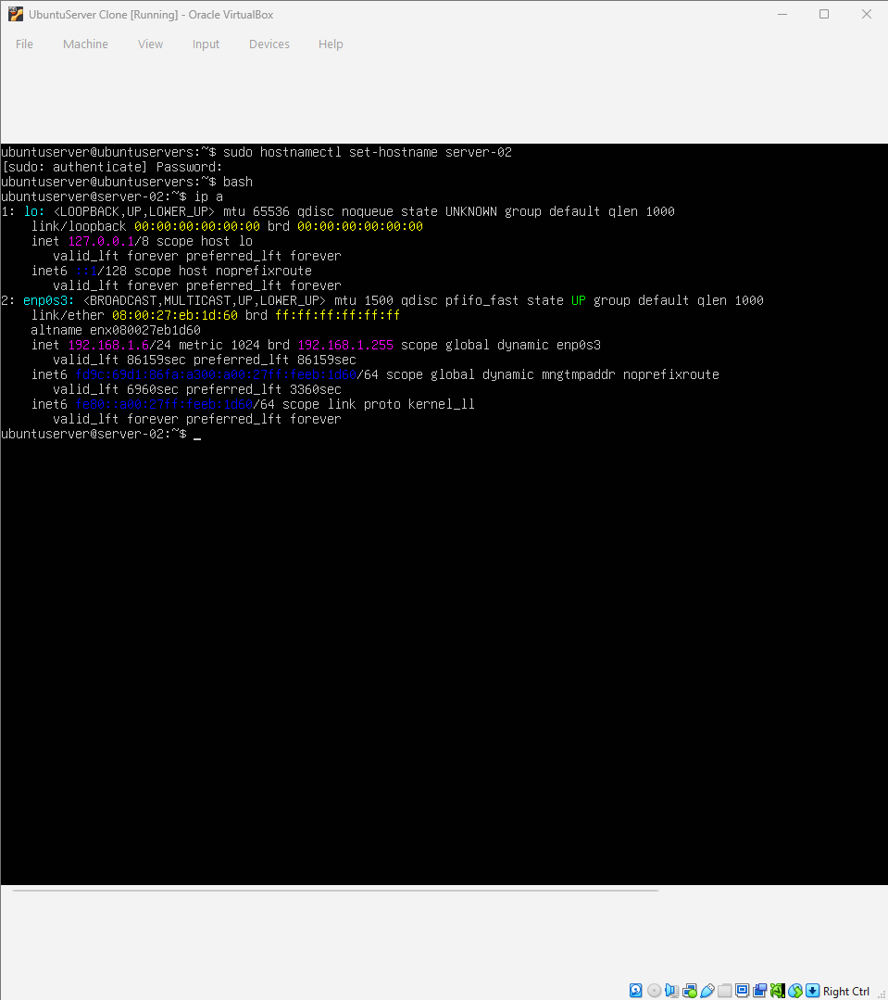

# Homework 2: Network Communication Between Virtual Servers

**Author:** Francisco Javier Sánchez Tasej

Evidences of network configuration, hostname assignment and the ping between two virtualized servers.

---

## 1. Server 1 Configuration
IP address assigned through the bridge adapter and the configuration of the new hostname of the first server:

## 2. Server 2 Configuration
IP address assigned through the bridge adapter and the configuration of the new hostname of the second server:

## 3. Successful Connection Test (Ping between VMs)
Successful response of the packages sent from Server 1 to Server 2 and server 2 to server 1

