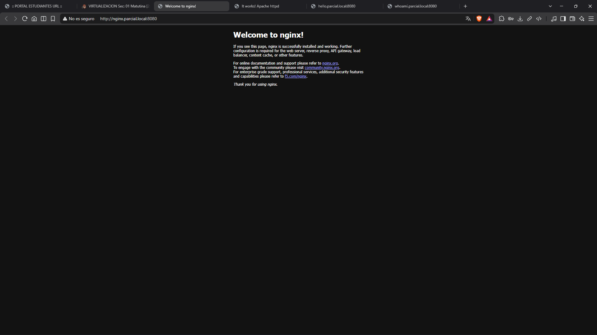
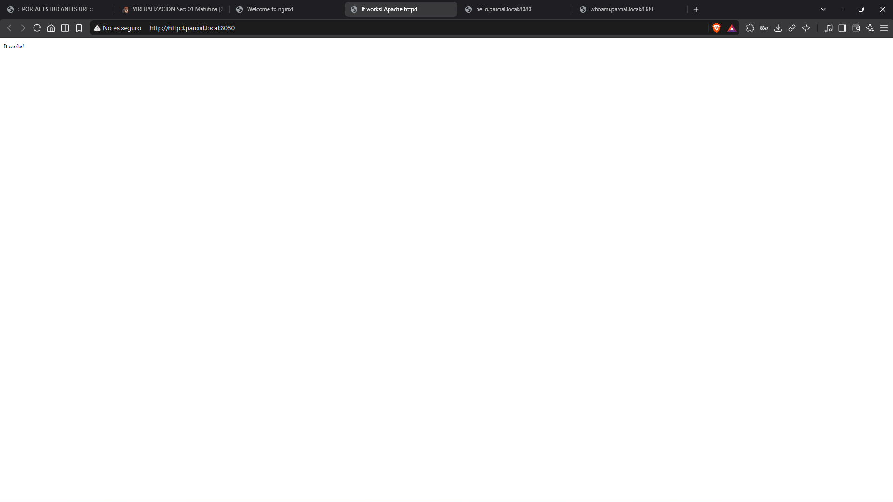
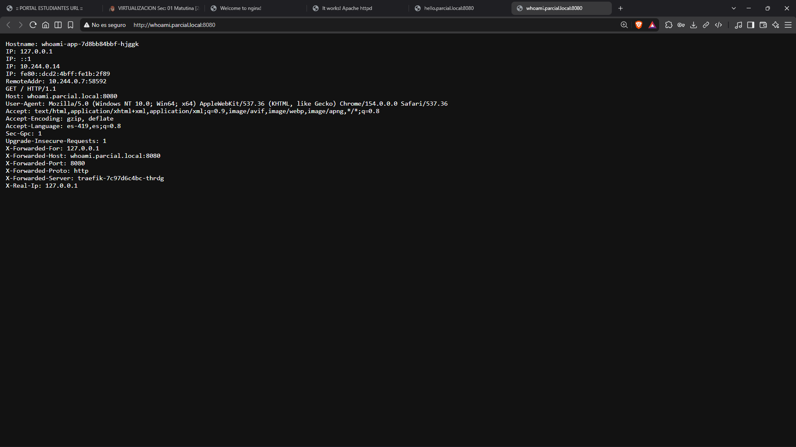
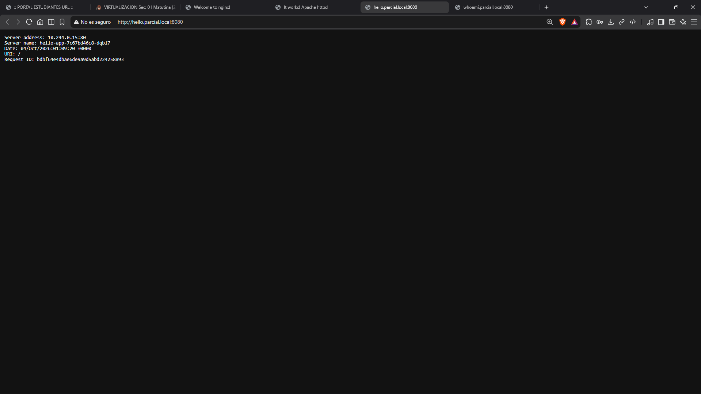

# Assessment 02 - Traefik & MetalLB on Minikube

This repository contains the required configurations to deploy MetalLB, Traefik, and 4 web applications on my local Minikube cluster, successfully exporting services through a single IP as requested in the evaluation.

## Minikube Setup & Environment

I set up the local Minikube cluster using Docker as the driver (within a WSL2 environment). The internal IP of my Minikube cluster was `192.168.49.2`.

## 1. MetalLB Configuration

To allow exporting public IPs (or in this case, specific IPs within the Minikube network), I installed MetalLB.

- **Namespace**: `metallb-system`
- **IaC Configuration**: The manifests are located in the `metallb/` directory.
- I installed the native MetalLB CRDs and deployed the controller.
- I configured an `IPAddressPool` to provide a single IP address: `192.168.49.100`.
- I also configured the `L2Advertisement` resource to announce the IP.

## 2. Traefik Configuration

I installed Traefik to act as the Ingress Controller and handle traffic routing to the different services.

- **Namespace**: `traefik`
- **IaC Configuration**: The manifests are located in the `traefik/` directory.
- I created a `ServiceAccount`, a `ClusterRole`, and a `ClusterRoleBinding` so Traefik can securely access the necessary cluster resources.
- I deployed the Traefik Pod with `--api.insecure` and `--providers.kubernetesingress` arguments enabled.
- Traefik was exposed using a `LoadBalancer` Service. Thanks to MetalLB, Traefik was successfully assigned the IP `192.168.49.100`.

## 3. Web Applications & Services Deployment

I chose 4 different web applications to demonstrate the routing capabilities. Each app has its own `Deployment` and `Service`, and they all share a single `Ingress` rule managed by Traefik.

- **Namespace**: `parcial-fjst` (using my initials)
- **Applications**:
  1. **Nginx** -> `nginx.parcial.local`
  2. **Apache HTTPD** -> `httpd.parcial.local`
  3. **Traefik Whoami** -> `whoami.parcial.local`
  4. **NGINX Hello** -> `hello.parcial.local`
- **IaC Configuration**: The manifests are located in the `apps/` directory (`apps.yaml` and `ingress.yaml`).
- The `Ingress` resource routes incoming traffic to the corresponding service based on the requested host name.

---

## How to Test the Project Locally (Windows / WSL2)

Since I am running Minikube inside WSL2, the Minikube internal IP (`192.168.49.100`) is not directly routable from the Windows browser. To make the domains accessible from the host, I performed the following workaround:

### Step 1: Port-Forward Traefik to Localhost

Open a terminal in the WSL environment and run the following command to bridge the Traefik service to the local machine:

```bash
kubectl port-forward -n traefik svc/traefik 8080:80 --address 0.0.0.0
```

### Step 2: Update the Windows `hosts` File

Open Notepad as Administrator in Windows and edit the `C:\Windows\System32\drivers\etc\hosts` file. Add the following line at the end:

```text
127.0.0.1 nginx.parcial.local httpd.parcial.local whoami.parcial.local hello.parcial.local
```

### Step 3: Access the Services

Now, you can access the applications from the Windows browser using port `8080`.

---

## Deliverables & Screenshots

Here is the evidence of accessing all 4 web services correctly from the browser using their corresponding domain names:

### 1. Nginx Application



### 2. Apache HTTPD Application



### 3. Traefik Whoami Application



### 4. NGINX Hello Application


